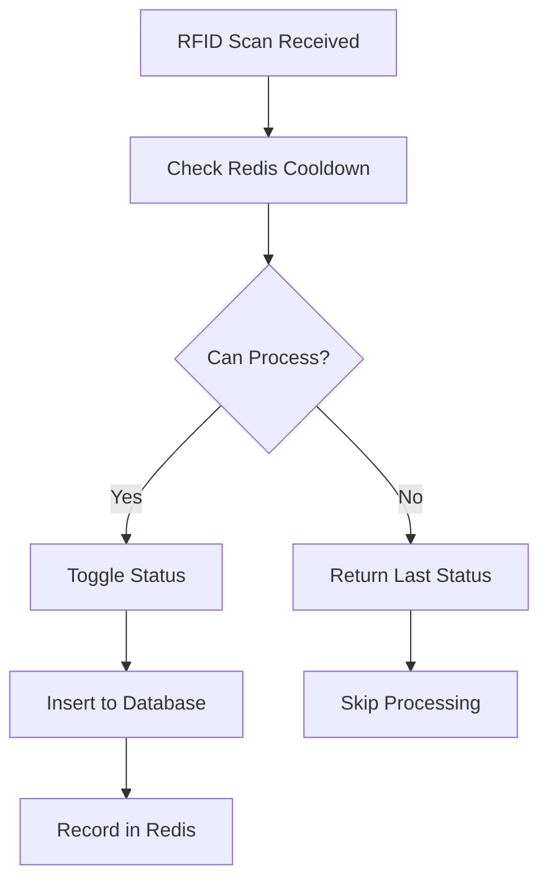

# Redis Location Tracking Implementation

## Overview
This implementation uses Redis to manage the 30-second cooldown functionality for location tracking scans. It prevents duplicate posts within 30 seconds for the same EPC, PO number, item number, and location combination, and automatically toggles the status when the cooldown period expires.

## Features

### ✅ **30-Second Cooldown Management**
- Prevents duplicate scans within 30 seconds
- Uses Redis for fast, in-memory storage
- Automatic status toggling (in ↔ out)
- Configurable cooldown period

### ✅ **Smart Status Toggle**
- If last status was 'in' → next scan becomes 'out'
- If last status was 'out' → next scan becomes 'in'
- First scan always defaults to 'in'

### ✅ **Redis Key Management**
- Keys format: `location_tracking:{epc}:{po_number}:{item_number}:{location_code}`
- TTL: 1 hour (longer than cooldown for status tracking)
- Automatic cleanup of expired keys

## Architecture

### **Files Created/Modified:**

1. **`src/utils/redisClient.ts`** - Redis connection management
2. **`src/services/locationTrackingRedis.ts`** - Location tracking Redis service
3. **`src/app/modules/location-trackers/location-trackers.service.ts`** - Updated to use Redis
4. **`src/server.ts`** - Added Redis connection initialization
5. **`src/config/index.ts`** - Added Redis URL configuration

## How It Works

### **1. Scan Processing Flow:**



### **2. Redis Data Structure:**

```json
{
  "epc": "E200001234567890",
  "po_number": "PO123456",
  "item_number": "ITEM001",
  "location_code": "LOC001",
  "status": "in",
  "timestamp": 1697280000000
}
```

### **3. Key Generation:**
```
Key: location_tracking:E200001234567890:PO123456:ITEM001:LOC001
TTL: 3600 seconds (1 hour)
```

## API Methods

### **LocationTrackingRedis Service:**

```typescript
// Check if scan can be processed
await locationTrackingRedis.canProcessScan(epc, po_number, item_number, location_code)
// Returns: { canProcess: boolean, lastStatus?: 'in'|'out', timeRemaining?: number }

// Record a scan
await locationTrackingRedis.recordScan(epc, po_number, item_number, location_code, status)

// Get last status
await locationTrackingRedis.getLastStatus(epc, po_number, item_number, location_code)

// Get cooldown status
await locationTrackingRedis.getCooldownStatus(epc, po_number, item_number, location_code)

// Clear tracking data
await locationTrackingRedis.clearTrackingData(epc, po_number, item_number, location_code)

// Get all active tracking
await locationTrackingRedis.getAllActiveTracking()
```

## Configuration

### **Environment Variables:**
```env
REDIS_URL=redis://localhost:6379
```

### **Default Settings:**
- Cooldown period: 30 seconds
- Redis key TTL: 1 hour
- Connection retry: 10 attempts with exponential backoff

## Usage Examples

### **1. Basic Scan Processing:**
```typescript
const scanData = {
  epc: 'E200001234567890',
  location_code: 'LOC001'
};

// Check if scan can be processed
const cooldownCheck = await locationTrackingRedis.canProcessScan(
  scanData.epc,
  'PO123456',
  'ITEM001',
  'LOC001'
);

if (cooldownCheck.canProcess) {
  // Process the scan
  const newStatus = cooldownCheck.lastStatus === 'in' ? 'out' : 'in';
  
  // Insert to database
  // ... database logic ...
  
  // Record in Redis
  await locationTrackingRedis.recordScan(
    scanData.epc,
    'PO123456',
    'ITEM001',
    'LOC001',
    newStatus
  );
} else {
  // Skip processing, return last status
  console.log(`Cooldown active: ${cooldownCheck.timeRemaining}s remaining`);
}
```

### **2. Check Cooldown Status:**
```typescript
const status = await locationTrackingRedis.getCooldownStatus(
  'E200001234567890',
  'PO123456',
  'ITEM001',
  'LOC001'
);

console.log(`In cooldown: ${status.isInCooldown}`);
console.log(`Time remaining: ${status.timeRemaining}s`);
console.log(`Last status: ${status.lastStatus}`);
```

## Testing

### **Run the test script:**
```bash
cd Backend
node test-redis-location-tracking.js
```

### **Expected Output:**
```
🧪 Testing Redis Location Tracking...

1. Testing first scan...
✅ First scan result: { canProcess: true }
✅ Recorded first scan as "in"

2. Testing immediate second scan...
✅ Second scan result: { canProcess: false, lastStatus: 'in', timeRemaining: 30 }

3. Testing cooldown status...
✅ Cooldown status: { isInCooldown: true, timeRemaining: 30, lastStatus: 'in' }

4. Testing last status...
✅ Last status: in

5. Testing all active tracking...
✅ All active tracking: [{ epc: 'E200001234567890', ... }]

🎉 Redis location tracking test completed successfully!
```

## Benefits

### **1. Performance:**
- Redis is much faster than database queries
- In-memory storage for instant lookups
- Reduces database load

### **2. Scalability:**
- Handles high-frequency scans efficiently
- Redis clustering support for horizontal scaling
- Automatic key expiration

### **3. Reliability:**
- Fail-safe design (allows processing if Redis fails)
- Connection retry logic
- Graceful error handling

### **4. Maintainability:**
- Clean separation of concerns
- Easy to modify cooldown period
- Comprehensive logging

## Monitoring

### **Redis Commands for Monitoring:**
```bash
# Check Redis connection
redis-cli ping

# List all location tracking keys
redis-cli keys "location_tracking:*"

# Check specific key
redis-cli get "location_tracking:E200001234567890:PO123456:ITEM001:LOC001"

# Check TTL
redis-cli ttl "location_tracking:E200001234567890:PO123456:ITEM001:LOC001"
```

### **Log Messages:**
- `✅ Connected to Redis` - Successful connection
- `❌ Disconnected from Redis` - Connection lost
- `🔄 Redis: Toggling status in → out` - Status toggle
- `🚫 Redis: Within 30s cooldown → skipping` - Cooldown active
- `📝 Redis: Recorded scan` - Successful recording

## Troubleshooting

### **Common Issues:**

1. **Redis Connection Failed:**
   - Check if Redis server is running
   - Verify REDIS_URL environment variable
   - Check network connectivity

2. **Cooldown Not Working:**
   - Check Redis key TTL
   - Verify timestamp accuracy
   - Check for Redis memory issues

3. **Status Not Toggling:**
   - Verify last status in Redis
   - Check cooldown period logic
   - Ensure proper key generation

### **Debug Commands:**
```bash
# Check Redis logs
redis-cli monitor

# Check memory usage
redis-cli info memory

# Check connected clients
redis-cli client list
```

## Future Enhancements

- [ ] Redis clustering support
- [ ] Custom cooldown periods per location
- [ ] Analytics and reporting
- [ ] WebSocket notifications for cooldown status
- [ ] Batch processing for multiple scans
- [ ] Redis persistence configuration
- [ ] Health check endpoints
- [ ] Metrics and monitoring dashboard

## Notes

- Redis keys automatically expire after 1 hour
- The system is fail-safe: if Redis is unavailable, scans are processed normally
- All Redis operations are wrapped in try-catch blocks
- Connection is established during server startup
- Graceful shutdown closes Redis connection
